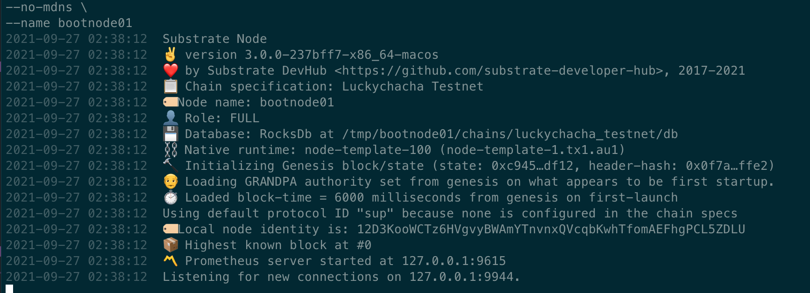
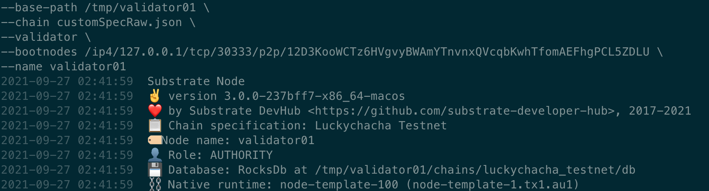

> 编程作业，需要完成以下要求并且提交代码链接：
> 1.为 template 模块的 do_something 添加 benchmark 用例（也可以是其它自选模块的可调用函数），并且将 benchmark 运行的结果转换为对应的权重定义；

```shell 
 （1）编写 benchmarking.rs【pallets/template/src/benchmarking.rs】
 （2）编译：cargo build  --features runtime-benchmarks --release
 （3）生成 weights.rs 文件，执行命令：
target/release/node-template benchmark \
--chain dev \
--execution=wasm \
--wasm-execution=compiled \
--pallet pallet_template \
--extrinsic do_something \
--steps 20 \
--repeat 50 \
--template=.maintain/frame-weight-template.hbs \
--output=pallets/template/src/weights.rs

（4）修改 pallets/template/src/lib.rs
```

```rust

...省略
mod benchmarking;
pub mod weights;
...省略

#[frame_support::pallet]
pub mod pallet {
  ...省略
	pub use crate::weights::WeightInfo;
  ...省略

	/// Configure the pallet by specifying the parameters and types on which it depends.
	#[pallet::config]
	pub trait Config: frame_system::Config {
		/// Because this pallet emits events, it depends on the runtime's definition of an event.
		type Event: From<Event<Self>> + IsType<<Self as frame_system::Config>::Event>;

		type WeightInfo: WeightInfo;
	}
  #[pallet::call]
	impl<T: Config> Pallet<T> {
		/// An example dispatchable that takes a single value as a parameter, writes the value to
		/// storage and emits an event. This function must be dispatched by a signed extrinsic.
		#[pallet::weight(T::WeightInfo::do_something(*something))]
		pub fn do_something(origin: OriginFor<T>, something: u32) -> DispatchResultWithPostInfo {
			// Check that the extrinsic was signed and get the signer.
			// This function will return an error if the extrinsic is not signed.
			// https://substrate.dev/docs/en/knowledgebase/runtime/origin
			let who = ensure_signed(origin)?;

			// Update storage.
			<Something<T>>::put(something);

			// Emit an event.
			Self::deposit_event(Event::SomethingStored(something, who));
			// Return a successful DispatchResultWithPostInfo
			Ok(().into())
		}
    ...省略
  }
```

>（5）修改 runtime/src/lib.rs

```rust
...省略
impl pallet_template::Config for Runtime {
	type Event = Event;
	type WeightInfo = pallet_template::weights::SubstrateWeight<Runtime>;
}

  ...省略
	#[cfg(feature = "runtime-benchmarks")]
	impl frame_benchmarking::Benchmark<Block> for Runtime {
  ...省略
    add_benchmark!(params, batches, pallet_template, TemplateModule);
  ...省略
  }

```

2.选择 node-template 或者其它节点程序，生成 Chain Spec 文件（两种格式都需要）；

```rust
（1）修改 chain_spec.rs、command.rs，添加自己的一个测试测试网络。
（2）生成初始节点账号：subkey generate                               
Secret phrase:       basket symptom mango woman penalty regular kick juice divide industry play disease
  Secret seed:       0x8d44c568eaf167693a340912dc3ab956905986f0b094a3745e220ab3058d0c60
  Public key (hex):  0xce161c9a41f67e707ec1eb10fc5744f817fb2b7a62e7ecec5969bf31fd175619
  Account ID:        0xce161c9a41f67e707ec1eb10fc5744f817fb2b7a62e7ecec5969bf31fd175619
  Public key (SS58): 5GivHmhJskTczMJk1omx6tQKX67k1Ad9iwkXp5E4jDqoTmsg
  SS58 Address:      5GivHmhJskTczMJk1omx6tQKX67k1Ad9iwkXp5E4jDqoTmsg

（3）生成认证人节点账号【Aura+Grandpa】
Aura:
subkey generate --scheme sr25519
Secret phrase:       shift slush speak replace globe behind extra laugh coral soccer angle love
  Secret seed:       0x01a8948238cabd0c3d3b9bc902175cebcb8b2664d07391f71c28592f86fd0ade
  Public key (hex):  0xf6ce8c7a2fb82190d206fb217c8586cb9386f1a9d5f2d8f751df91a1fc361b39
  Account ID:        0xf6ce8c7a2fb82190d206fb217c8586cb9386f1a9d5f2d8f751df91a1fc361b39
  Public key (SS58): 5HeJze42DT9au7ErpLfSQuhH2Yox7GN2PNv9XVUVeVNgR2S8
  SS58 Address:      5HeJze42DT9au7ErpLfSQuhH2Yox7GN2PNv9XVUVeVNgR2S8

subkey generate --scheme sr25519
Secret phrase:       pave clog stick proud light utility large add puppy ahead deal canyon
  Secret seed:       0xb6a9637d0c84253e1efb4e5a7cb93444f04970c50d0b191738637c045d307ed4
  Public key (hex):  0xb60f48e54023aa50f41a6f127962ea06f4534c3a8cffba33b129fa38e4963857
  Account ID:        0xb60f48e54023aa50f41a6f127962ea06f4534c3a8cffba33b129fa38e4963857
  Public key (SS58): 5GBR7VMr1hWeBAvd8Cz9JmbzvREHuxcbVFat6NxdrPpeTY6x
  SS58 Address:      5GBR7VMr1hWeBAvd8Cz9JmbzvREHuxcbVFat6NxdrPpeTY6x
GRANDPA

subkey inspect --scheme ed25519 "shift slush speak replace globe behind extra laugh coral soccer angle love"
Secret phrase:       shift slush speak replace globe behind extra laugh coral soccer angle love
  Secret seed:       0x01a8948238cabd0c3d3b9bc902175cebcb8b2664d07391f71c28592f86fd0ade
  Public key (hex):  0x3e321d707bf167050793233cbfb9f2e6727e84f3f33f518a40630357a89ffb7c
  Account ID:        0x3e321d707bf167050793233cbfb9f2e6727e84f3f33f518a40630357a89ffb7c
  Public key (SS58): 5DUFiKiMrAksvSQ6FRfFjG9fX6fGFXYPg5FdeGT8ahXdfTzd
  SS58 Address:      5DUFiKiMrAksvSQ6FRfFjG9fX6fGFXYPg5FdeGT8ahXdfTzd

subkey inspect --scheme ed25519 "pave clog stick proud light utility large add puppy ahead deal canyon"
Secret phrase:       pave clog stick proud light utility large add puppy ahead deal canyon
  Secret seed:       0xb6a9637d0c84253e1efb4e5a7cb93444f04970c50d0b191738637c045d307ed4
  Public key (hex):  0x0381fef06e163699b164531d85dbbde802de101b36f8dd1172b0bb83c289c5bb
  Account ID:        0x0381fef06e163699b164531d85dbbde802de101b36f8dd1172b0bb83c289c5bb
  Public key (SS58): 5C9Jcn2aZFuXsJ9BTTo64EHiC5AXgXtz3AqxiYDs9fR6e1ba
  SS58 Address:      5C9Jcn2aZFuXsJ9BTTo64EHiC5AXgXtz3AqxiYDs9fR6e1ba

（4）把生成的信息填入 node/src/chain_spec.rs 文件中：

pub fn local_luckychacha_testnet_config() -> Result<ChainSpec, String> {
	let wasm_binary = WASM_BINARY.ok_or_else(|| "Development wasm binary not available".to_string())?;

	Ok(ChainSpec::from_genesis(
		// Name
		"Luckychacha Testnet",
		// ID
		"luckychacha_testnet",
		ChainType::Local,
		move || testnet_genesis(
			wasm_binary,
			// Initial PoA authorities
			vec![(
                // 5HeJze42DT9au7ErpLfSQuhH2Yox7GN2PNv9XVUVeVNgR2S8
                hex!["f6ce8c7a2fb82190d206fb217c8586cb9386f1a9d5f2d8f751df91a1fc361b39"].unchecked_into(),
                // 5DUFiKiMrAksvSQ6FRfFjG9fX6fGFXYPg5FdeGT8ahXdfTzd
                hex!["3e321d707bf167050793233cbfb9f2e6727e84f3f33f518a40630357a89ffb7c"].unchecked_into(),
            ),(
                // 5GBR7VMr1hWeBAvd8Cz9JmbzvREHuxcbVFat6NxdrPpeTY6x
                hex!["b60f48e54023aa50f41a6f127962ea06f4534c3a8cffba33b129fa38e4963857"].unchecked_into(),
                // 5C9Jcn2aZFuXsJ9BTTo64EHiC5AXgXtz3AqxiYDs9fR6e1ba
                hex!["0381fef06e163699b164531d85dbbde802de101b36f8dd1172b0bb83c289c5bb"].unchecked_into(),
            )],
			// Sudo account
			hex![
				// 5GivHmhJskTczMJk1omx6tQKX67k1Ad9iwkXp5E4jDqoTmsg	
				"ce161c9a41f67e707ec1eb10fc5744f817fb2b7a62e7ecec5969bf31fd175619"
			].into(),
			// Pre-funded accounts sr25519
			vec![
				// 5GivHmhJskTczMJk1omx6tQKX67k1Ad9iwkXp5E4jDqoTmsg	
				hex!["ce161c9a41f67e707ec1eb10fc5744f817fb2b7a62e7ecec5969bf31fd175619"].into(),	
			],
			true,
		),
		// Bootnodes
		vec![],
		// Telemetry
		None,
		// Protocol ID
		None,
		// Properties
		None,
		// Extensions
		None,
	))
}

（5）生成 customSpec.json 文件【生成文件位于项目根目录下】：
  ./target/release/node-template build-spec --chain luckychacha > customSpec.json

（6）生成 customSpecRaw.json 文件【生成文件位于项目根目录下】：
./target/release/node-template build-spec --chain=customSpec.json --raw > customSpecRaw.json

```

（附加题）根据 Chain Spec，部署公开测试网络*

> 1.初始化

```shell
./target/release/node-template purge-chain --base-path /tmp/bootnode01 --chain luckychacha -y
```

> 2.启动 bootnode 节点

```shell
./target/release/node-template \
--base-path /tmp/bootnode01 \
--chain customSpecRaw.json \
--unsafe-rpc-external \
--no-mdns \
--name bootnode01
```



> 3.启动验证人节点【由于时间来不及，验证人节点启动暂时存在问题，还需后续研究】

```shell
./target/release/node-template \
--base-path /tmp/validator01 \
--chain customSpecRaw.json \
--validator \
--bootnodes /ip4/127.0.0.1/tcp/30333/p2p/12D3KooWCTz6HVgvyBWAmYTnvnxQVcqbKwhTfomAEFhgPCL5ZDLU \
--name validator01
```


